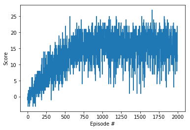

# Algorithm
Deep Q-learning is a deep reinforcement learning algorithm that combines Q-learning, an algorithm for learning optimal actions in an environment, with deep neural networks. It aims to enable agents to learn optimal actions in complex, high-dimensional environments. Q-learning is a model-free reinforcement learning algorithm that learns a Q-function, which maps from state-action pairs to expected rewards. The Q-function is updated using a temporal difference (TD) learning rule, which calculates the difference between the expected reward of the current state-action pair and the actual reward received after taking the action.

Deep Q-learning uses a deep neural network to approximate the Q-function. This allows the algorithm to handle environments with a large number of states and actions, as well as to learn from high-dimensional inputs such as images or sensor data.

The deep Q-learning algorithm works as follows:
- Initialize a deep neural network to approximate the Q-function.
- Initialize a replay buffer to store past experiences.
- Interact with the environment and collect experiences.
- Sample a batch of experiences from the replay buffer.
- Calculate the target Q-values for the sampled experiences.
- Update the weights of the deep neural network using the target Q-values.
- Repeat steps 3-6 until the agent converges to an optimal policy.

In this project, I utilized the the Double Deep Q-Network, or Double DQN to reduce overestimation by decomposing the max operation in the target into action selection and action evaluation. The motivation behind the Double Q-Network is that we evaluating the greedy policy according to the online network, but we also use the target network to estimate its value. 
The update is the same as for DQN, but replacing the target $Y_{t}^{DQN}$ with:

 $$Y_{t}^{DoubleDQN} = R_{t+1} + \gamma $$ 

Compared to the original formulation of Double Q-Learning, in Double DQN the weights of the second network are replaced with the weights of the target network for the evaluation of the current greedy policy.

# Result
The average scores over 2000 iterations:

 The number of episodes needed to solve the environment is at about iteration 600 (with the average score from iteration 500-600 is 13.49)

# Improvement 
We can improve the algorithm by Prioritized Experience Relay (Create a weight for to assign priorities to each tuple with larger errors when sampling) or Dueling DQN with estimation the state values and state-action values as desired Q-values.

